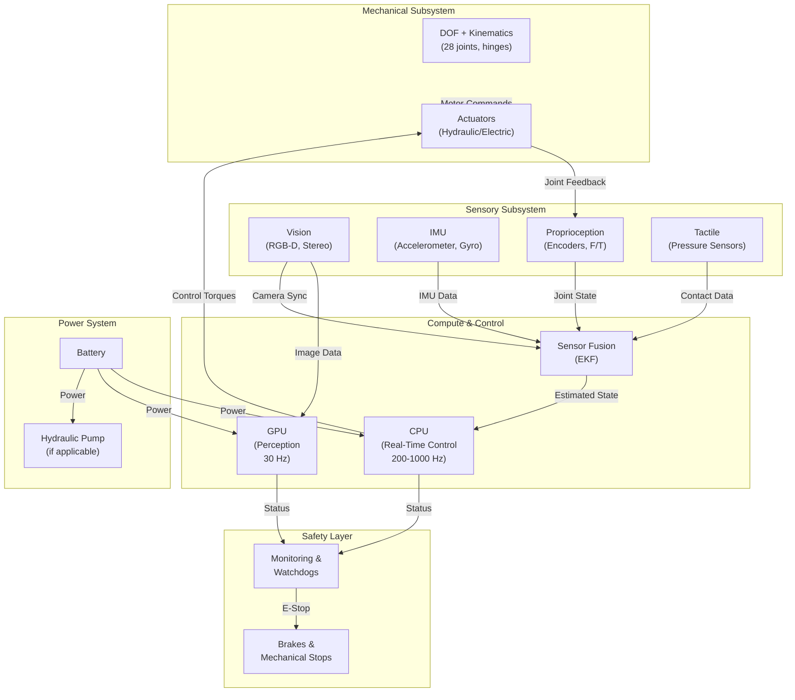

# Chapter 2: Mechanical Structure & Kinematics

## The Foundation: Degrees of Freedom and Kinematic Chains

A humanoid robot's body is a kinematic chain — a series of joints connected by rigid links. Each joint that can move independently is called a **degree of freedom (DOF)**. The human body has roughly 244 DOF when counting fingers, but humanoid robots typically have 20–35 DOF: some for the torso, some for the head, and the majority distributed across the arms and legs.

**Why does DOF matter?** Because DOF directly affects:

1. **Control Complexity**: More joints = more state variables = higher computational load. A 28-DOF robot requires tracking 28 joint positions, 28 joint velocities, and computing control torques for 28 actuators. This scales control computation quadratically.

2. **Manipulation Capability**: The human hand has ~27 DOF (counting fingers). A robot arm with only 6 DOF (shoulder, elbow, wrist) cannot achieve fine dexterity — it can reach and orient the end-effector but not flex individual fingers. Boston Dynamics Atlas has sufficient hand DOF for grasping diverse objects. (Boston Dynamics, 2023)

3. **Bandwidth and Speed**: Fewer, heavier joints can move quickly but cannot fine-tune movements. More, lighter joints enable smooth coordination but require faster control loops. Atlas' 28-DOF design balances speed (can run at 1.6 m/s) with dexterity (can manipulate objects). (Boston Dynamics, 2023)

4. **Power Efficiency**: Each additional joint adds actuators, sensors, and compute. The more DOF, the larger the power budget. Atlas' hydraulic system provides the power density (roughly 1000 W/kg) needed for 28-DOF coordinated control. (Alfayad et al., 2016)

## Kinematic Structure: How Mechanical Design Shapes Control

The *arrangement* of joints is equally important as their count. Consider the leg of a humanoid:

- **Hip (3 DOF)**: Abduction/adduction (sideways tilt), flexion/extension (forward/back), internal/external rotation
- **Knee (1 DOF)**: Flexion/extension only
- **Ankle (2 DOF)**: Flexion/extension and inversion/eversion

This structure mirrors the human leg. But it creates a **kinematic constraint**: the knee is a hinge joint. To walk smoothly, the robot must coordinate hip and ankle movements to track a desired foot trajectory. This constraint is not accidental — it is a design choice that simplifies control. A knee with 2 DOF (pitch and roll) would provide more flexibility but would require more complex control algorithms. (Ramezani et al., 2021)

## System Integration Overview: Hardware and Software in Concert

Before diving deeper into individual subsystems, it helps to visualize how mechanical structure, sensors, actuators, and compute interact as a unified system:

**Diagram 1: Hardware-Software Integration** — System block diagram showing subsystem interactions. [SOURCE: Diagram reference - FR-008 SC-003]

---

## Boston Dynamics Atlas: A Case Study in Mechanical Design

Atlas has **28 DOF distributed as**:
- **Legs** (12 DOF): 3 DOF hip + 1 DOF knee + 2 DOF ankle = 6 DOF per leg
- **Arms** (12 DOF): 3 DOF shoulder + 1 DOF elbow + 2 DOF wrist = 5 DOF per arm (plus hand dexterity)
- **Torso and Head** (4 DOF): Spine articulation and head rotation

This distribution is carefully balanced: enough leg DOF for stable walking and recovery from perturbations, enough arm DOF for object manipulation. Atlas weighs approximately 80 kg (roughly human weight), which grounds it on the same leg mass as humans — a key factor for stable bipedal walking. (Boston Dynamics, 2023)

**Key Design Decision**: Why does Atlas use *hydraulics* rather than electric motors, given electric motors are simpler and lighter? Hydraulic systems can deliver 1000+ W/kg of power density, enabling Atlas to generate explosive forces for jumping, rapid acceleration, and heavy load lifting (up to 45 kg). Electric motors at similar torque would require larger gear reduction and heat dissipation, making the system heavier and slower. This trade-off — complex hydraulics for high power density — is a fundamental architectural decision that shapes everything downstream: the compute system must handle real-time servo control of high-pressure hydraulic systems, the power budget must account for hydraulic pump noise and thermal losses, and the safety system must monitor pressure to prevent explosive failure. (Alfayad et al., 2016)

---

## References

Alfayad, S., Ouezdou, F. B., Namoun, F., Bruneau, O., & Henaff, P. (2016). Development of a fast torque-controlled hydraulic humanoid robot that can balance compliantly. *2016 IEEE-RAS 16th International Conference on Humanoid Robots (Humanoids)*, 673–680. IEEE. https://ieeexplore.ieee.org/document/7363420/

Boston Dynamics. (2023). Atlas Robot Specifications and Documentation. Retrieved from https://www.bostondynamics.com/

Morisawa, M., Benallegue, M., Cisneros, R., Kaneko, K., Kanehiro, F., & Kheddar, A. (2021). 3D biped locomotion control including seamless transition between walking and running via 3D ZMP manipulation. *2021 IEEE/RSJ International Conference on Intelligent Robots and Systems (IROS)*, 6623–6630. IEEE. https://ieeexplore.ieee.org/document/9561503/

Ramezani, A., Hurst, J. W., Hamed, K. A., & Grizzle, J. W. (2021). Planar Bipedal Locomotion with Nonlinear Model Predictive Control: Online Gait Generation using Whole-Body Dynamics. *2022 IEEE/RSJ International Conference on Intelligent Robots and Systems (IROS)*, 11819–11826. IEEE. https://ieeexplore.ieee.org/document/10000132/

Wang, X., Guo, W., Zhang, T., Lu, Z., & Zhao, M. (2025). Robust Dynamic Walking for Humanoid Robots via Computationally Efficient Footstep Planner and Whole-Body Control. *Journal of Intelligent & Robotic Systems*, Vol. 111, Article 49. Springer. https://doi.org/10.1007/s10846-025-02249-w
