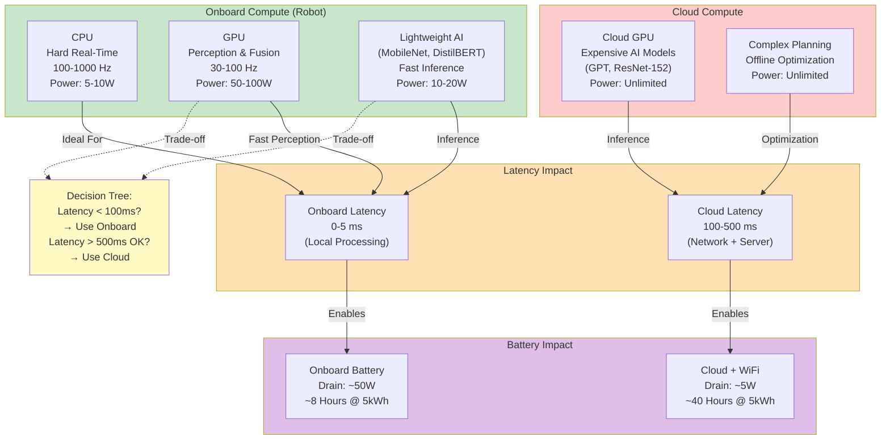

# Chapter 5: Hardware Compute & Real-Time OS

A humanoid robot must execute multiple tasks in parallel:
- **Real-time control loops** (200–1000 Hz): Reading sensors, computing control torques, commanding actuators. Missing a deadline even once can cause the robot to fall.
- **Perception** (20–30 Hz): Running vision CNNs to detect objects, estimate grasping points
- **Planning** (10–20 Hz): Deciding the next action (move forward, grasp object, etc.)
- **Logging and monitoring** (1–10 Hz): Recording data for debugging and analysis

These tasks have **different real-time requirements**:

## CPU: Hard Real-Time Control

The **control loop must run at a fixed frequency with predictable latency**. For walking at 1 m/s, missing even one control cycle (~10 ms) can cause the robot to stumble. This is **hard real-time**: missing deadlines causes failure.

Traditionally, hard real-time requires a **Real-Time Operating System (RTOS)** like VxWorks or QNX. Modern approaches use **Linux RT** (a patched version of Linux with real-time scheduling) or **ROS 2 on a real-time kernel**.

**Dedicated CPU cores** run the control loop. For Boston Dynamics Atlas, this likely means:
- One or more cores reserved exclusively for the control loop at 200–500 Hz
- Core isolation: other tasks (perception, logging) cannot interrupt this core
- Latency budget: less than 1 ms from sensor reading to actuator command (Barbalace et al., 2020)

## GPU: Perception and Planning

Vision processing (CNNs) and motion planning (sampling-based algorithms) are computationally expensive. A **GPU (Graphics Processing Unit)** accelerates these:

- **Vision CNN inference**: Detecting objects in 640×480 images. Modern networks (like YOLO or Faster R-CNN) can run at 30 FPS on an onboard GPU (e.g., NVIDIA Jetson AGX).
- **Sensor fusion**: Large-scale EKF with 100+ state variables can be GPU-accelerated
- **Motion planning**: Sampling-based planners (RRT, PRM) benefit from GPU parallelism

Boston Dynamics Atlas likely uses an NVIDIA GPU for perception. (Kumar & Prasad, 2023)

## Edge AI Trade-Off: Onboard vs. Cloud

**Onboard GPU** (local compute):
- **Advantage**: Low latency (computation happens on the robot, no network delay)
- **Disadvantage**: High power consumption (~50–100 W for GPU)
- **Use case**: Tasks requiring less than 100 ms response time (grasp reaction, collision avoidance)

**Cloud GPU** (remote compute):
- **Advantage**: Low power on robot, access to large models (GPT-scale language models), easy updates
- **Disadvantage**: High latency (~100–500 ms over WiFi/LTE), connectivity dependent, privacy concerns
- **Use case**: Offline tasks (planning a complex manipulation sequence, learning new skills)

Module 5 will explore hybrid approaches: use lightweight models onboard for fast reaction, offload expensive models to the cloud for planning. (Qiu et al., 2024)

## Compute & Hardware Placement: Edge AI Trade-Offs

The decision of where to run computations (onboard CPU/GPU vs. cloud) has cascading effects:

**Diagram 4: Compute & Hardware Placement** — Decision tree for edge AI showing latency vs. power trade-offs. Real-time control loops (5–10 ms deadlines) must run onboard; expensive models can offload to cloud if latency tolerance is >500 ms. [SOURCE: Edge AI architecture - FR-008 SC-003]

---

## References

Barbalace, A., Luchetta, A., Schmidt, G., Stitt, L., Phelps, P., & Xenofon, D. (2020). Real-time design based on PREEMPT_RT and timing analysis of collaborative robot control system. In *Intelligent Robotics and Applications: 14th International Conference, ICIRA 2021* (pp. 607–619). Springer. https://doi.org/10.1007/978-3-030-89098-8_56

Boston Dynamics. (2023). Atlas Robot Specifications and Documentation. Retrieved from https://www.bostondynamics.com/

Kumar, K., & Prasad, R. (2023). Object Detection with YOLO Model on NAO Humanoid Robot. In *Pattern Recognition and Machine Intelligence: 10th International Conference, PReMI 2023* (pp. 492–502). Springer. https://doi.org/10.1007/978-3-031-45170-6_51

Qiu, Y., Zhang, Y., Huang, Z., Liu, H., & Hu, Y. (2024). Deep Reinforcement Learning for Sim-to-Real Transfer in a Humanoid Robot Barista. *2024 IEEE-RAS 23rd International Conference on Humanoid Robots (Humanoids)*, 1–8. IEEE. https://ieeexplore.ieee.org/document/10907454/

Tobin, J., Fong, R., Ray, A., Schneider, J., Zaremba, W., & Abbeel, P. (2017). Domain randomization for transferring deep neural networks from simulation to the real world. *2017 IEEE/RSJ International Conference on Intelligent Robots and Systems (IROS)*, 23–30. IEEE. https://doi.org/10.1109/IROS.2017.8202133
